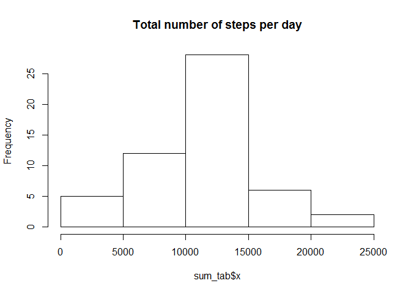
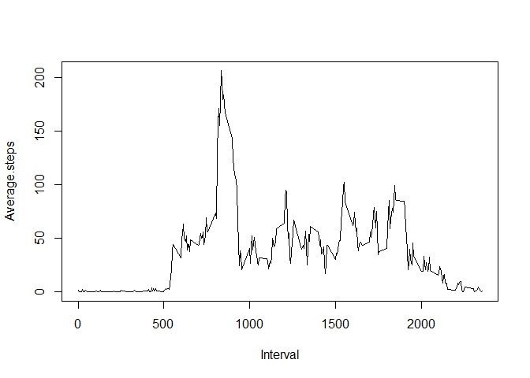
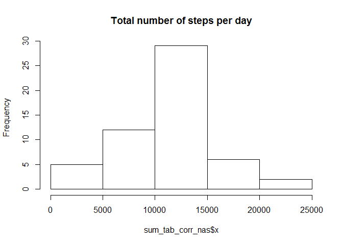
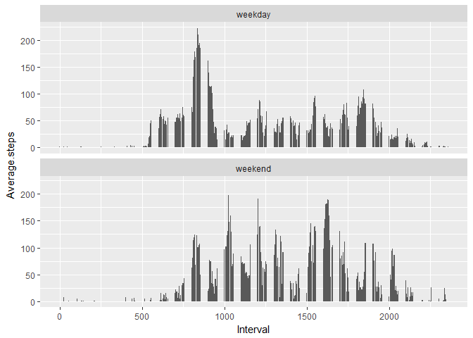

# Reproducible Research:  Peer Assessment 1


## Loading and preprocessing the data

```r
file <- read.csv("activity.csv")
file$date <- as.Date(file$date , format = "%Y-%m-%d")
file_wo_na <- file[complete.cases(file), ]
```


## What is mean total number of steps taken per day?

```r
sum_tab <- aggregate(file_wo_na$steps, by = list(file_wo_na$date), FUN = "sum")
hist(sum_tab$x, main = "Total number of steps per day")
```

<!-- -->

Mean:

```r
mean(sum_tab$x)
```

```
## [1] 10766.19
```

Median:

```r
median(sum_tab$x)
```

```
## [1] 10765
```


## What is the average daily activity pattern?

```r
 mean_by_interval <- aggregate(file_wo_na$steps, by = list(file_wo_na$interval), FUN = "mean")
 names(mean_by_interval) <- c("Interval", "Average.steps")
 with(mean_by_interval, plot(Interval, Average.steps, type = "l"))
```

<!-- -->

Interval with maximum number of steps:


```r
mean_by_interval[ which.max(mean_by_interval$Average.steps),]
```

```
##     Interval Average.steps
## 104      835      206.1698
```


## Imputing missing values

1. Calculate and report the total number of missing values in the dataset (i.e. the total number of rows with NAs)


```r
na <- file[!complete.cases(file), ]
summary(na)
```

```
##      steps           date               interval     
##  Min.   : NA    Min.   :2012-10-01   Min.   :   0.0  
##  1st Qu.: NA    1st Qu.:2012-10-26   1st Qu.: 588.8  
##  Median : NA    Median :2012-11-06   Median :1177.5  
##  Mean   :NaN    Mean   :2012-11-01   Mean   :1177.5  
##  3rd Qu.: NA    3rd Qu.:2012-11-11   3rd Qu.:1766.2  
##  Max.   : NA    Max.   :2012-11-30   Max.   :2355.0  
##  NA's   :2304
```

Devise a strategy for filling in all of the missing values in the dataset. The strategy does not need to be sophisticated. For example, you could use the mean/median for that day, or the mean for that 5-minute interval, etc.
Create a new dataset that is equal to the original dataset but with the missing data filled in.


```r
file_corrected_nas <- file

file_corrected_nas$steps <- ifelse(is.na(file_corrected_nas$steps), mean_by_interval[mean_by_interval$Interval == file_corrected_nas$interval, 2], file_corrected_nas$steps)
```
Make a histogram of the total number of steps taken each day and Calculate and report the mean and median total number of steps taken per day. Do these values differ from the estimates from the first part of the assignment? 


```r
sum_tab_corr_nas <- aggregate(file_corrected_nas$steps, by = list(file_corrected_nas$date), FUN = "sum")
hist(sum_tab_corr_nas$x, main = "Total number of steps per day")
```

<!-- -->

Mean:

```r
mean(sum_tab_corr_nas$x)
```

```
## [1] NA
```

Median:

```r
median(sum_tab_corr_nas$x)
```

```
## [1] NA
```


###What is the impact of imputing missing data on the estimates of the total daily number of steps?
#Delta Mean:

```r
mean(sum_tab_corr_nas$x) - mean(sum_tab$x)
```

```
## [1] NA
```


Delta Median:

```r
median(sum_tab_corr_nas$x) - median(sum_tab$x)
```

```
## [1] NA
```

## Are there differences in activity patterns between weekdays and weekends?

Create a new factor variable in the dataset with two levels - "weekday" and "weekend" indicating whether a given date is a weekday or weekend day.


```r
file_wo_na$daytype <- ifelse(weekdays(file_wo_na$date)  %in% c("Sonntag", "Sammstag"), 'weekend', 'weekday')
```


Make a panel plot containing a time series plot (i.e. type = "l") of the 5-minute interval (x-axis) and the average number of steps taken, averaged across all weekday days or weekend days (y-axis). See the README file in the GitHub repository to see an example of what this plot should look like using simulated data.

```r
 mean_by_interval <- aggregate(file_wo_na$steps, by = list(file_wo_na$interval, file_wo_na$daytype), FUN = "mean")
 names(mean_by_interval) <- c("Interval", "Daytype", "Average.steps")
 
 library(ggplot2)
 ggplot(mean_by_interval, aes(x = Interval, y = Average.steps)) + geom_bar(stat = "identity") + facet_wrap(~Daytype, nrow=2)
```

<!-- -->


